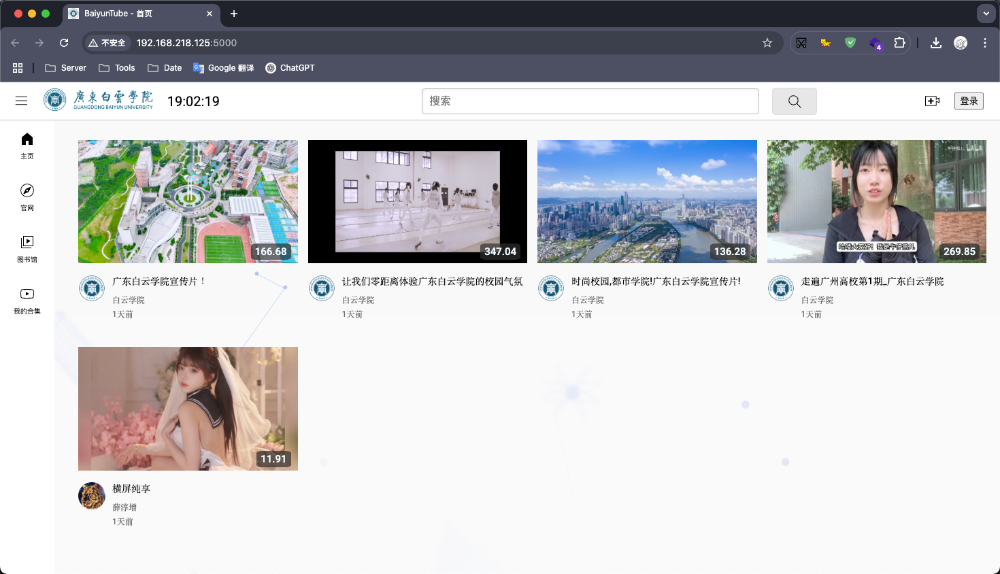
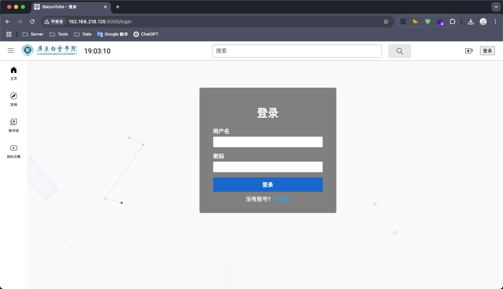
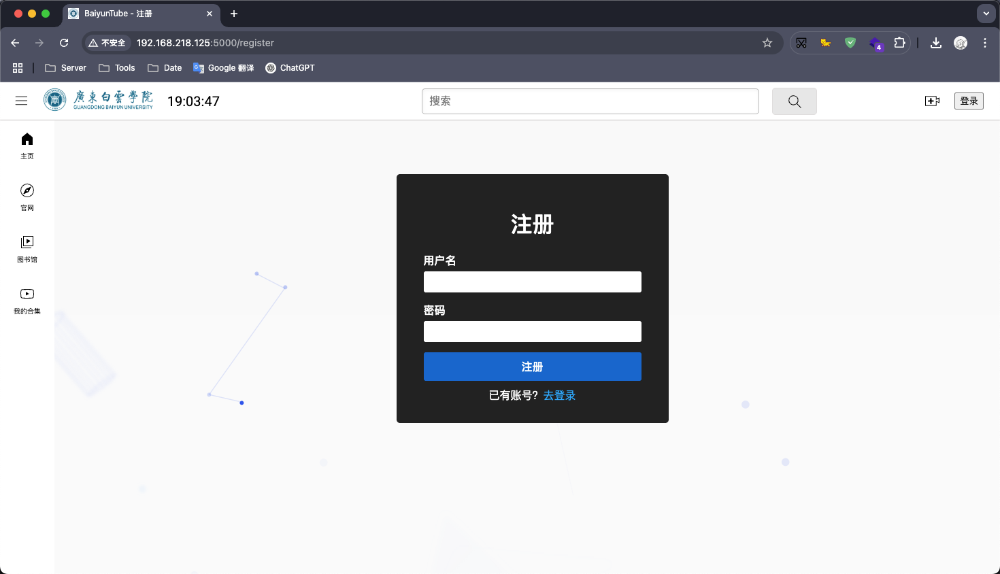
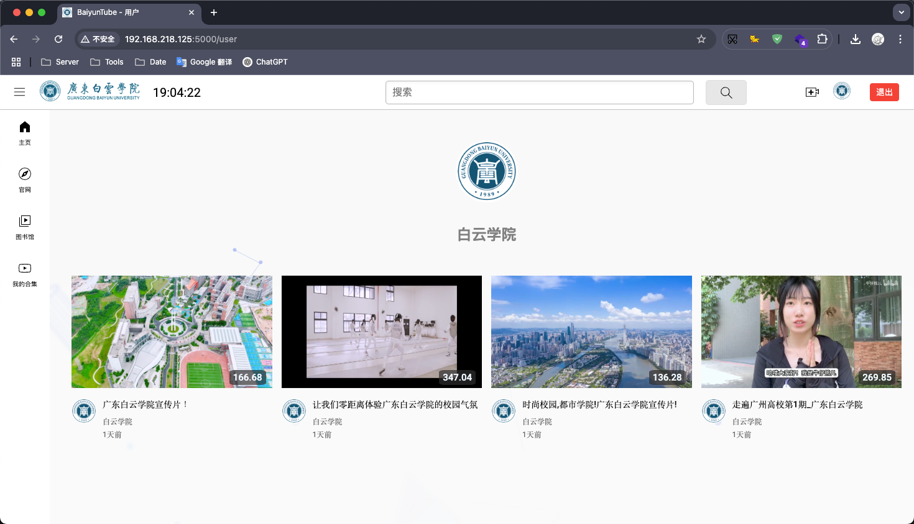
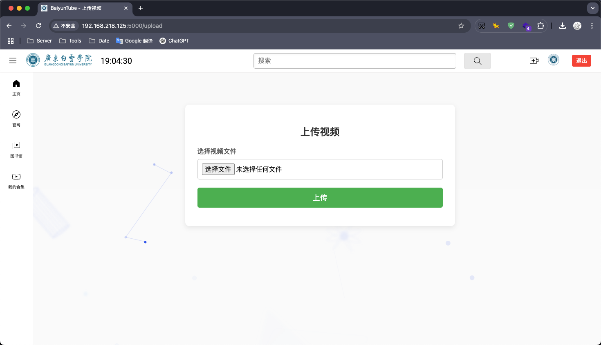
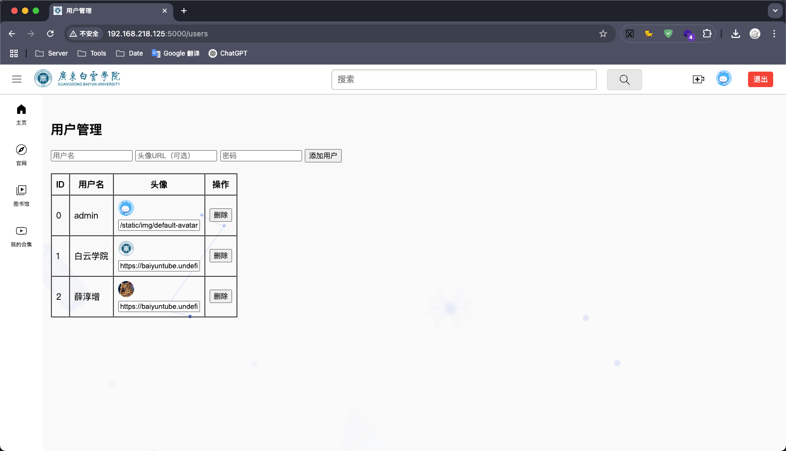
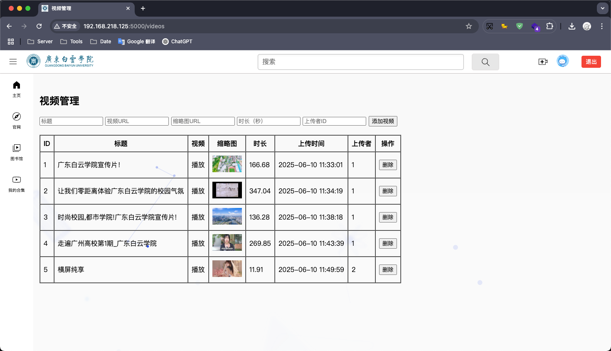

# BaiyunTube 视频分享平台

BaiyunTube 是一个基于 Flask 构建的视频分享平台，支持用户注册、登录、视频上传、播放与管理等功能，并提供后台管理支持。项目结合 FFmpeg 实现视频处理，并集成 S3 兼容存储，实现完整的视频站点基础功能。

---

## 📁 项目结构

```bash
BaiyunTube/
├── server.py                # 应用入口
├── templates/               # HTML 模板文件
│   ├── base.html            # 公共基础模板
│   ├── index.html           # 首页
│   ├── login.html           # 登录页
│   ├── register.html        # 注册页
│   ├── upload.html          # 上传视频
│   ├── video.html           # 视频播放页
│   ├── user.html            # 用户主页
│   ├── users.html           # 管理员用户管理
│   ├── videos.html          # 管理员视频管理
│   └── no_permission.html   # 无权限提示页
├── static/                  # 静态资源
│   ├── css/
│   ├── js/
│   ├── img/
│   └── icon/
├── utils/                   # 工具模块
│   ├── bucket.py            # S3 存储封装
│   ├── extensions.py        # 权限装饰器等
│   ├── ffmpeg.py            # 视频处理逻辑
│   ├── models.py            # 数据模型定义
│   └── response.py          # API 响应封装
└── views/                   # 路由控制器
    ├── api.py               # API 接口
    └── page.py              # 页面视图
```

---

## ⚙️ 技术栈

### 后端

* **Flask**：轻量 Python Web 框架
* **SQLAlchemy**：ORM 管理 SQLite 数据库
* **FFmpeg**：用于转码、生成缩略图
* **boto3**：S3 对象存储交互（支持 MinIO、阿里云、腾讯云等）

### 前端

* HTML / CSS / JavaScript
* jQuery + Jinja2 模板引擎

---

## 📌 功能模块

### 用户系统

* 用户注册 / 登录 / 登出
* 用户视频列表页
* 头像管理（URL 形式）

### 视频系统

* 视频上传（含格式校验）
* 自动转码（支持 CUDA 加速）
* 缩略图生成
* 视频播放与推荐展示
* 视频搜索功能（关键词匹配）

### 管理员系统

* 用户管理（增删查）
* 视频管理（增删查）

### 权限与认证

* 登录状态管理：基于 Flask `session`
* 自定义装饰器控制访问权限

  * `@check_token`
  * `@check_admin`
  * `@check_page`

---

## 🧱 数据库设计

### User 表

| 字段名      | 类型      | 描述        |
| -------- | ------- | --------- |
| id       | Integer | 主键        |
| username | String  | 用户名，唯一    |
| password | String  | 密码（加密）    |
| avatar   | String  | 头像 URL，可空 |

### Video 表

| 字段名         | 类型       | 描述              |
| ----------- | -------- | --------------- |
| id          | Integer  | 主键              |
| title       | String   | 视频标题            |
| video\_path | String   | 视频文件路径          |
| thumbnail   | String   | 视频缩略图路径         |
| duration    | String   | 视频时长（s）         |
| created\_at | DateTime | 上传时间            |
| user\_id    | Integer  | 外键，关联用户         |

---

## 🔧 系统实现要点

### 视频上传流程

1. 接收上传文件并生成唯一文件名
2. 使用 FFmpeg 进行转码（优先使用 GPU）
3. 提取封面图 + 获取视频时长
4. 上传视频文件与缩略图到对象存储
5. 写入数据库记录
6. 删除本地临时文件

### API 接口风格

* 遵循 RESTful 设计规范
* 响应结构统一：

```json
{
  "code": 200,
  "msg": "success",
  "data": {...}
}
```

---

## 💡 项目特色

* ✅ 支持 **GPU加速转码**（NVIDIA CUDA）
* ✅ 集成 **S3 兼容对象存储**（可切换 MinIO、阿里云等）
* ✅ 前端页面采用模块化模板继承，逻辑清晰
* ✅ 后端 API 与页面路由独立，方便维护与扩展
* ✅ 管理端具备基本内容审查功能

---

## 🧪 开发环境推荐

| 工具/环境        | 推荐配置         |
| ------------ | ------------ |
| Python       | >= 3.8       |
| Flask        | >= 2.0       |
| SQLite       | 内置支持         |
| FFmpeg       | 安装并配置系统路径    |
| CUDA Toolkit | 可选，启用 GPU 加速 |
| boto3        | 用于连接 S3 存储服务 |

---

## 📽️ 示例截图















---

## 🧰 部署

1、fork当前项目到自己组织（如为本组织成员忽略此步骤）。

2、点击`云原生开发`运行开发环境。

3、待环境初始化完成，运行下方代码：

```shell
pip install -r requirements.txt
```

```shell
python server.py
```

4、等待项目启动后，访问相关端口即可。

---

## 📚 总结

BaiyunTube 是一个适合学习和实战的 Flask 视频站点项目，具备基本的视频站点全流程，涵盖用户管理、视频处理、对象存储集成等多个技术点，适合作为：

* Flask 教学/课程设计项目
* 小型私有视频平台原型
* 后端工程师的中型实战练手项目

---
